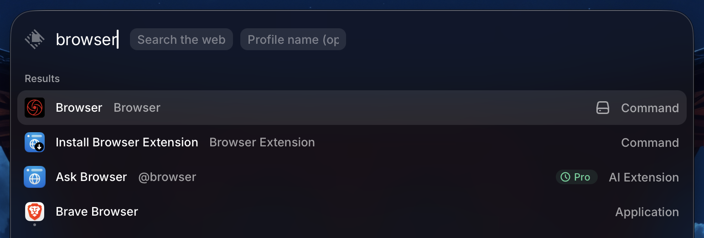
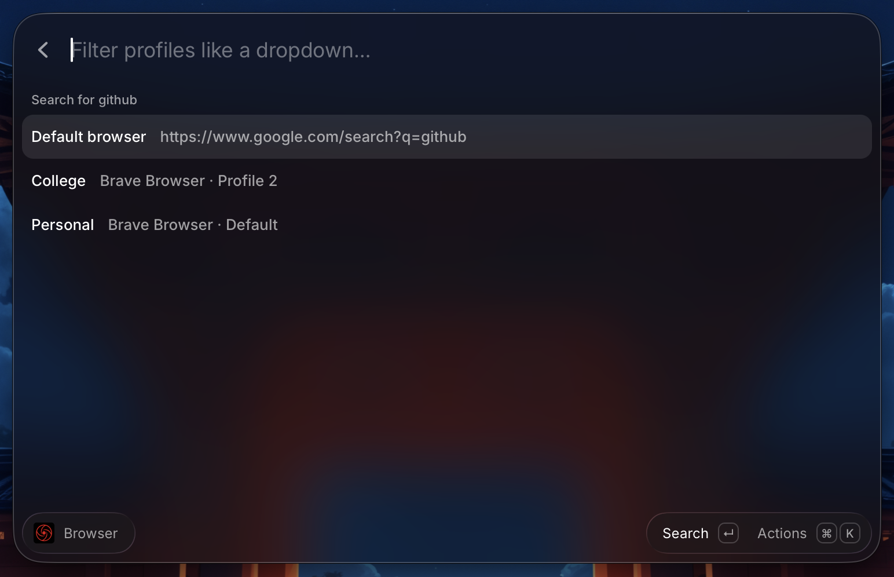
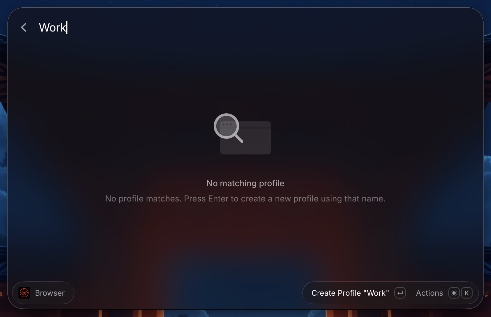
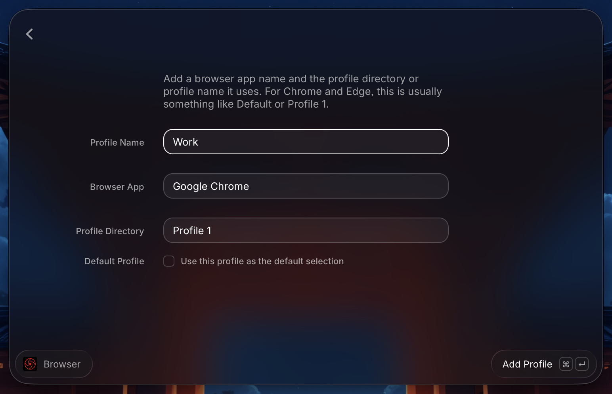

# Browser

Search the web in your default browser or launch the same query in a saved browser profile.

## How it works

Type your query as the command argument when you launch Browser. The command then shows a profile picker, with your default browser at the top and any saved profiles below it.

You can also pass an optional profile argument (for Quicklinks). The picker uses that value as an initial filter and preselects the closest profile match, while still letting you pick another profile from the list.

## Profile setup

1. Type the query you want to search
2. Type out the name of your profile
3. If you haven't setup your profile, it won't show up yet, so press Enter to set it up
4. Set your Profile name
5. Set the name of the browser you want to use for it
6. Set the profile id for your profile within that browser
7. That's it, for the next prompt, you should see your new profile in the dropdown

## Notes

This profile launcher uses the browser app name plus the profile directory string. For Chromium-based browsers, that is usually something like `Default` or `Profile 1`.